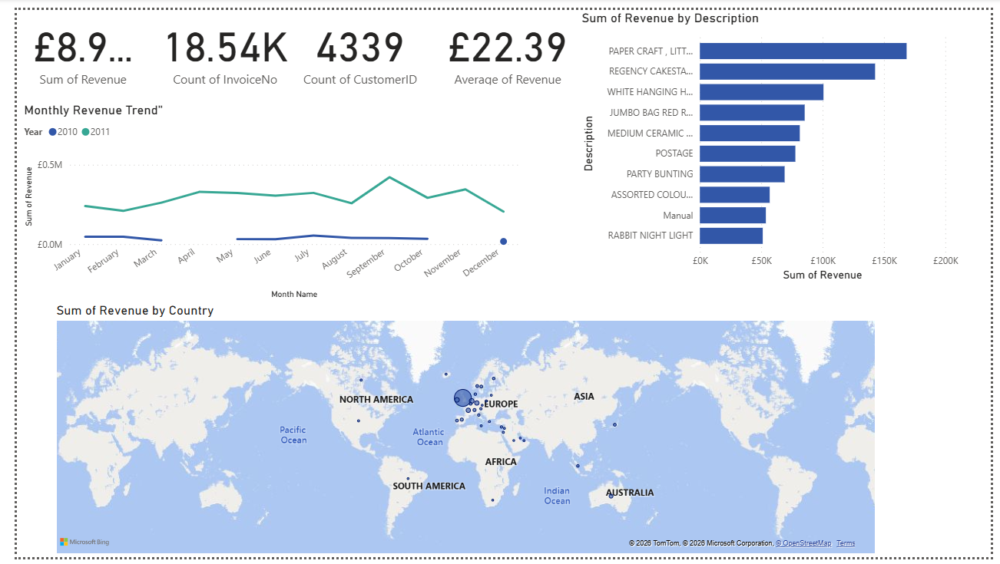
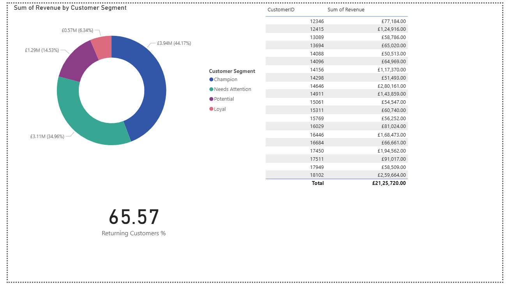
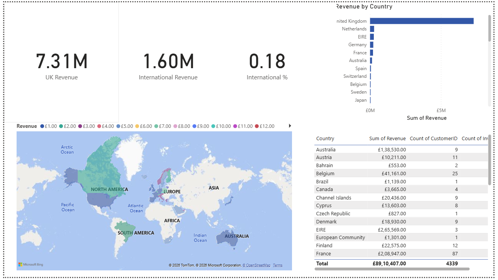

# 🛒 E-Commerce Sales & Customer Segmentation Dashboard

## 📊 Project Overview
An interactive 5-page Power BI dashboard analyzing 500,000+ 
e-commerce transactions to uncover revenue trends, customer 
behaviour, and product performance.

## 🔗 Live Dashboard
[View Live Dashboard on Power BI](https://app.powerbi.com/groups/me/reports/89f5c758-06f4-4bec-a9ce-48f3755b4ad3/ReportSection849d80ecd9e60870d442?experience=power-bi)

## 🛠️ Tools Used
- Power BI Desktop
- Power Query (Data Cleaning)
- DAX (Data Analysis Expressions)
- Dataset: UCI E-Commerce Dataset (500K+ rows)

## 📋 Dashboard Pages

### Page 1 — Executive Summary
- Total Revenue: £8.91M
- Total Orders: 18.54K
- Total Customers: 4,339
- Monthly revenue trend (2010 vs 2011)
- Top 10 products by revenue
- Revenue by country map

### Page 2 — Sales Trends
- Revenue by month and year
- Sales by day of week
- Month vs Year revenue matrix

### Page 3 — Customer Segmentation (RFM)
- Customer segments: Champion, Loyal, Potential, Needs Attention
- Champions drive 44% of total revenue
- 65.57% customer retention rate
- Top 20 customers by revenue

### Page 4 — Product Analysis
- Top 10 products by revenue
- Product revenue trend over time
- Product performance table

### Page 5 — Geographic Analysis
- UK Revenue: £7.31M
- International Revenue: £1.60M
- Revenue by country (filled map)
- Top 10 countries table

## 📸 Dashboard Screenshots

### Executive Summary

### Customer Segmentation
  

### Geographic Analysis

## 💡 Key Insights
- Top 20% of customers contribute 80% of revenue (Pareto principle)
- September-October peak season identified
- UK accounts for 82% of total revenue
- Tuesday is the highest revenue day of the week
- PAPER CRAFT is the best selling product
